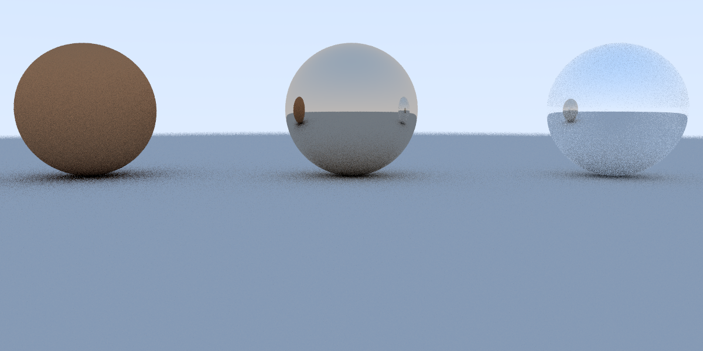
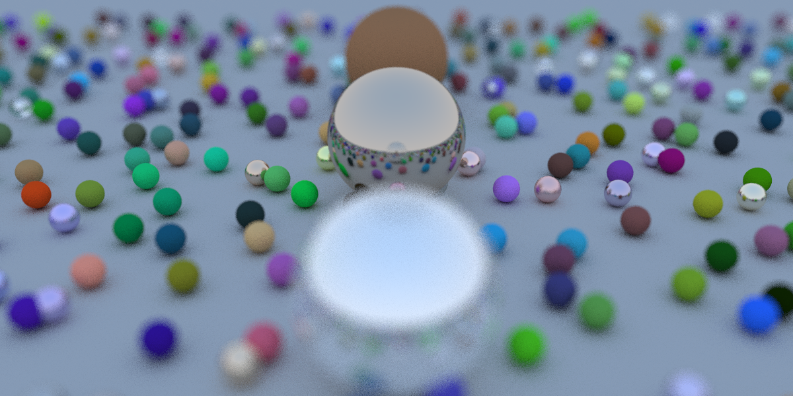
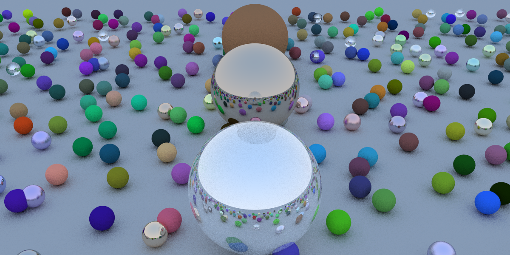

# 🚀 Ray Tracing in CUDA

This repository contains a **CUDA-based ray tracing system**.  
It features a **high-performance rendering framework**, **physically-based materials**, and **a configurable camera system**.  

🔗 **Technical Blog:** [Blog](https://zhangzs11.github.io/categories/Ray-Tracing/)  

---

## ✨ Features Overview

### 1️⃣ Core Ray Tracing Framework  
- Implemented a **ray tracing system** supporting **spheres as primary geometry**.
- Built an **efficient ray-object intersection algorithm** optimized for CUDA parallel execution.  

---

### 2️⃣ Physically-Based Materials  
- **Diffuse Material**: Simulates Lambertian reflection for realistic matte surfaces.  
- **Metallic Material**: Implements specular reflections with adjustable fuzziness.  
- **Dielectric (Glass) Material**: Supports light refraction using **Snell’s Law**.  

  

---

### 3️⃣ Configurable Camera System  
- Adjustable **lens aperture**, **focus distance**, and **view direction**.  
- Implements **depth of field (DOF)** for cinematic-style renders.  

  

  

---

